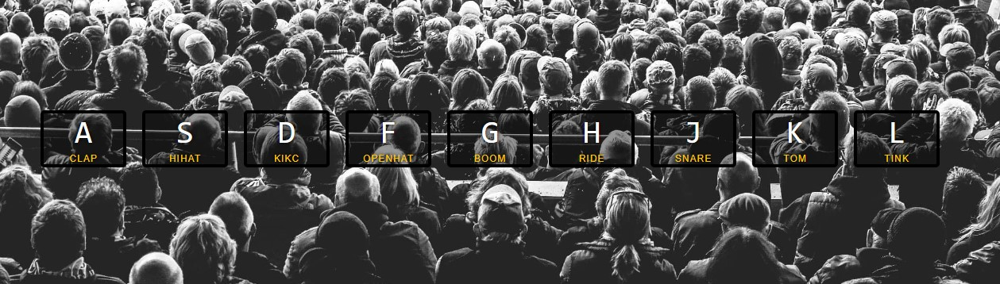

# Drum Kit 🥁

Nesse projeto é possível tocar bateria utilizando o teclado.

- [Objetivo](#objetivo)
- [Tecnologias](#tecnologias)
- [Autor](#autor)

Acesse o site <https://esther-cardoso.github.io/drum-kit/>

## Objetivo 

O objetivo desse projeto foi melhorar minhas habilidades em javascript.   Aqui eu trabalhei com eventos do teclado e audios.

## Tecnologias

As seguintes ferramentas foram usadas na construção do projeto:

- HTML
- CSS
- JavaScript

## Autor

Feito por Esther Cardoso 👋🏽 Entre em contato!

